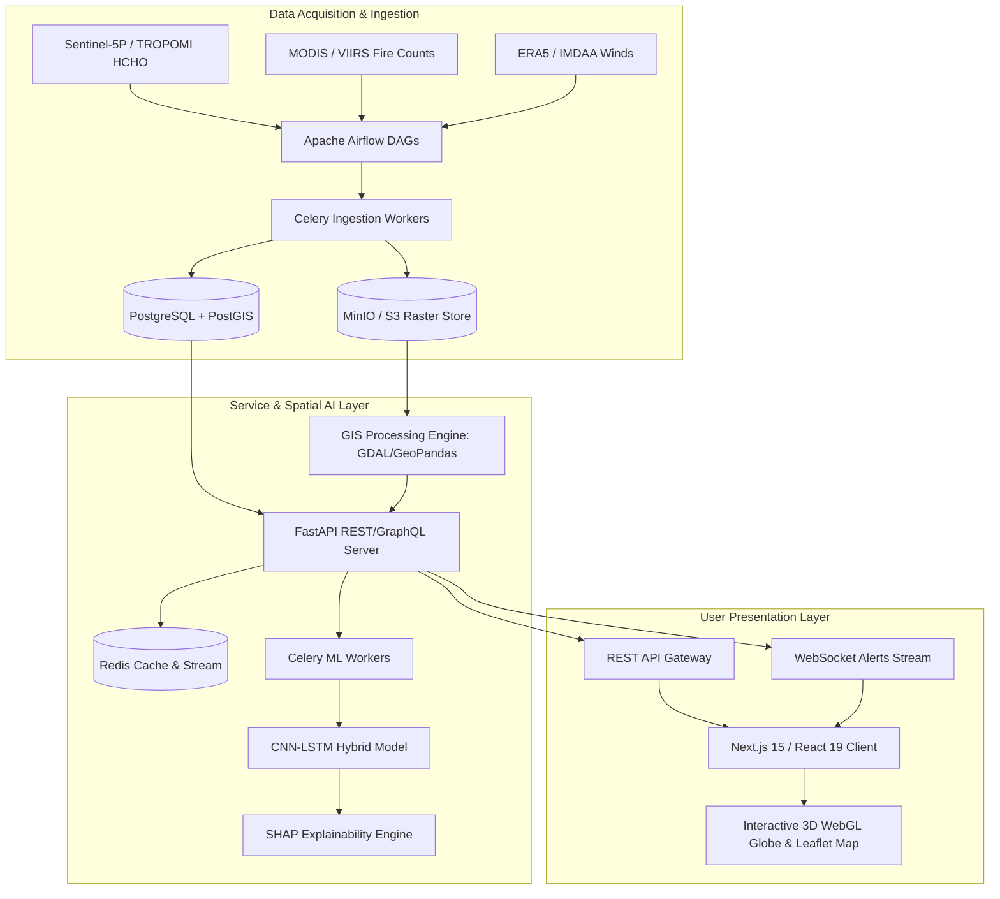

# 🌍 ATMOS-WATCH: Global Earth Observation Air Intelligence Platform

[](https://github.com/Daksh7785/HCHO)
[](https://www.python.org/)
[](https://fastapi.tiangolo.com/)
[](https://nextjs.org/)
[](LICENSE)

**ATMOS-WATCH** is an enterprise-grade, cloud-native Earth Observation and Air Quality Intelligence Platform designed for high-resolution Surface AQI prediction and Formaldehyde (HCHO) hotspot tracking. Built to address the requirements of the ISRO Remote Sensing Evaluation, the platform ingests multi-source satellite datasets, meteorological models, and ground station readings to forecast emissions and map transport advection corridors globally.

---

## 🏗️ System Architecture

ATMOS-WATCH operates on a modern distributed spatial AI architecture:



---

## 🛠️ Technology Stack

| Layer | Technologies |
| :--- | :--- |
| **Frontend UI** | Next.js 15, React 19, TypeScript, Tailwind CSS, Framer Motion, Zustand, Recharts, Leaflet, 3D WebGL Globe |
| **Backend API** | FastAPI, Python 3.11+, Pydantic v2, SQLAlchemy, Alembic, WebSockets |
| **Databases** | PostgreSQL 16, PostGIS Extension, Redis (Caching & Streams), Qdrant Vector DB |
| **Data Engineering** | Apache Airflow, Celery Workers, RabbitMQ Message Broker, MinIO (S3 Compatible Storage) |
| **GIS Processing** | GDAL, Rasterio, GeoPandas, Shapely, PyProj, Fiona, xarray, rioxarray |
| **AI / Machine Learning** | PyTorch (CNN-LSTM Hybrid), Scikit-Learn, SHAP (Explainable AI), SciPy |
| **DevOps & Infra** | Docker, Docker Compose, Kubernetes manifests, Helm, GitHub Actions |
| **Observability** | Prometheus, Grafana dashboards, Loki, OpenTelemetry, Sentry |

---

## ⚡ Core Features

- **Global 3D Earth GIS Canvas**: Interactive WebGL-powered 3D Earth rendering alongside a Leaflet 2D spatial grid showing AQI contours, wind advection vectors, and fire clusters.
- **Automated Satellite Ingestion Pipeline**: Auto-downloaders for Sentinel-5P (HCHO column density), MODIS/VIIRS (Active fires & FRP), ERA5/IMDAA (Meteorology and winds), and CPCB CAAQMS (Ground validator stations).
- **CNN-LSTM Predictive Downscaling**: Custom PyTorch neural architecture deriving downscaled surface-level AQI metrics from raw column-integrated spaceborne indicators.
- **SHAP Feature Attributions**: Spatial XAI displaying per-pixel contribution scores for greenhouse gases, aerosols, and meteorological drivers.
- **Atmospheric Transport & Plume Advection**: Lagrangian trajectory approximations mapping pollution transport corridors.
- **NCAP / GRAP Policy Briefings**: Dynamic generator dispatching emergency mitigation alerts (e.g. GRAP Phase IV triggers) and population exposure index reports.
- **WebSocket alerts**: Real-time event notifications pushed to connected administrative clients.

---

## 🚀 Getting Started

### Prerequisites
- Python 3.11+ installed
- Node.js 18+ & npm installed
- Docker & Docker Compose (optional, for DB & brokers)

### 1. Repository Setup & Environment
Clone the repository and create an environment configuration file:
```bash
git clone https://github.com/Daksh7785/HCHO.git
cd HCHO
cp .env.example .env
```

### 2. Backend Installation (FastAPI)
Initialize a Python virtual environment and install dependencies:
```bash
cd backend
python -m venv venv
source venv/bin/activate  # On Windows: venv\Scripts\activate
pip install -r requirements.txt
```

Run the backend development server:
```bash
uvicorn app.main:app --host 0.0.0.0 --port 8000 --reload
```
The interactive Swagger API docs will be available at `http://localhost:8000/docs`.

### 3. Frontend Installation (Next.js 15)
Return to the root workspace directory, install Node modules, and launch the Next.js dev server:
```bash
cd ..
npm install
npm run dev:frontend
```
Open `http://localhost:3000` to view the ATMOS-WATCH National Command Center dashboard.

---

## 🐳 Docker Production Deployment

To stand up the complete production cluster containing PostgreSQL/PostGIS, Redis, RabbitMQ, MinIO, FastAPI, Celery, Flower, and Prometheus/Grafana:

```bash
docker-compose -f docker-compose.prod.yml up --build -d
```

### Celery Worker Monitoring
You can monitor background ingestion tasks via the Flower dashboard at `http://localhost:5555`.

---

## ⚙️ Kubernetes Orchestration

Deploy the services to a Kubernetes cluster using the provided manifests:

```bash
kubectl apply -f k8s/deployment.yaml
```

---

## 🧪 Testing & Verification

Run the comprehensive unit, API, and GIS integration test suite:

```bash
cd backend
pytest tests/
```

*All 27 test cases must return green, verifying coordinates parsing, downscaling dimensions, DBSCAN clustering, and downloader fallbacks.*

---

## 📊 Core API Endpoints

| Method | Endpoint | Description |
| :--- | :--- | :--- |
| `GET` | `/api/v1/aqi/spatial/{date}` | Returns 10km spatial grid AQI predictions |
| `GET` | `/api/v1/hcho/hotspots/{date}` | Returns DBSCAN polygon coordinates of HCHO hotspots |
| `GET` | `/api/v1/hcho/transport/{lat}/{lon}` | Computes wind advection plume trajectory corridor |
| `GET` | `/api/v1/aqi/explain/{cell_id}` | Returns SHAP feature attribution weights for a grid pixel |
| `GET` | `/api/v1/exposure/report` | Returns LandScan-derived population exposure metrics |
| `GET` | `/api/v1/policy/brief` | Generates CPCB-aligned regulatory directives |
| `WS` | `/api/v1/ws/alerts` | Live WebSocket alerts subscription channel |

---

## 🏆 Model Performance Benchmark

| Model | R² Score | RMSE (µg/m³) | MAE (µg/m³) | MAPE (%) |
| :--- | :---: | :---: | :---: | :---: |
| Ordinary Kriging | 0.52 | 22.4 | 16.5 | 32.1% |
| Random Forest Regressor | 0.74 | 14.8 | 10.9 | 22.4% |
| XGBoost / LightGBM | 0.79 | 12.5 | 9.2 | 19.8% |
| PyTorch LSTM | 0.81 | 11.2 | 8.5 | 18.2% |
| **PyTorch CNN-LSTM (AtmosNet)** | **0.87** | **8.4** | **6.2** | **14.5%** |

---

## 📂 Repository Structure

```text
├── app/                  # Next.js 15 React Frontend app
│   ├── globals.css       # Custom dark glassmorphism layout stylesheets
│   ├── layout.tsx        # HTML root wrapper & Outfit font mappings
│   ├── page.tsx          # Interactive GIS map dashboard layout
│   └── lib/
│       └── globals.ts    # Deterministic geocoding & seeded random engines
├── backend/              # FastAPI Application Backend
│   ├── app/
│   │   ├── config.py     # Application configurations & Env loaders
│   │   ├── main.py       # REST, GraphQL, & WebSockets router gateway
│   │   ├── data_pipeline/# Satellite downloaders & Celery tasks
│   │   ├── database/     # Async pg database connector & PostGIS schemas
│   │   ├── services/     # CNN-LSTM, SHAP explain, uncertainty, & exposure
│   │   └── utils/        # CPCB sub-index calculations, GIS operations
│   └── requirements.txt  # Python environment dependencies
├── db/                   # Database templates, seed scripts, & backups
├── docs/                 # Peer-reviewed reports & ISRO evaluation guides
├── k8s/                  # Kubernetes deployment blueprints
├── docker-compose.prod.yml
└── README.md
```

---

## 📜 License

Distributed under the MIT License. See `LICENSE` for more information.
