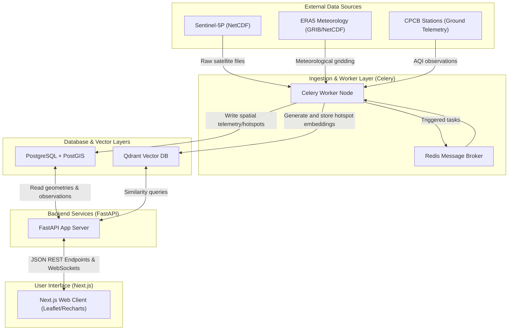

# HCHO Platform Architecture

This document describes the high-level software architecture, data processing systems, and layout of the **HCHO Air Quality Monitoring Platform**.

---

## 1. System Topology

Below is a diagram of the platform's core components:

---

## 2. Core Architectural Layers

### A. Data Ingestion Pipeline (Celery + Earth Observation SDKs)
- **Satellite Ingestor**: Periodically checks the Copernicus Data Space Ecosystem / Planetary Computer STAC catalog for new Sentinel-5P TROPOMI Formaldehyde (L2/L3) tiles covering India.
- **Meteorology Downloader**: Pulls relative humidity, wind vectors, and boundary layer heights from Copernicus Climate Data Store (CDS).
- **CPCB Scraper**: Accesses Central Pollution Control Board (India) API to retrieve ground AQI measurements for calibration.

### B. Deep Learning Model Layer (PyTorch)
- **Spatial Resolution Interpolator**: Combines low-resolution TROPOMI columns (approx. 5.5 x 3.5 km) with high-density ground observations to predict local surface HCHO levels using a spatial-temporal U-Net.
- **Hotspot Detector**: Applies clustering on the interpolated spatial layers to segment anomalies and quantify Fire Radiative Power (FRP) correlation.

### C. Backend API Layer (FastAPI)
- Exposes RESTful endpoints for spatial telemetry, historical charts, and active burning alerts.
- Integrates asynchronous database pools using SQLAlchemy and asyncpg.

### D. Geospatial Visualization Client (Next.js + Leaflet)
- Displays dynamic raster tiles of Formaldehyde concentrations and polygon boundaries of burning hotspots.
- Charts real-time and historical air quality metrics using Recharts.

---

## 3. Database Schema Design

- **`monitoring_stations`**: Relational points holding geographic station markers in PostGIS format.
- **`station_observations`**: Time-series store of telemetry, partitioned by date ranges in production.
- **`hcho_hotspots`**: Polygonal boundaries of burning sites, tracking intensity and fire radiative power.
- **`qdrant` collections**: Storing event embeddings for semantic querying of historical fire clusters.
